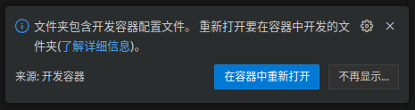

# VSCode ROS2 Workspace Template

此模板将帮助你使用 VSCode 作为 IDE 设置 ROS2。（汉化修改版本）

> 来源
>
> - 博客： [how I develop with vscode and ros2](https://www.allisonthackston.com/articles/vscode_docker_ros2.html) 
> - 原版本：https://github.com/athackst/vscode_ros2_workspace

## 1. 功能描述

### 格式化工具

IDE 中包含了 ROS2 认可的格式化工具。 

* **C++** 使用 uncrustify；配置文件来自 `ament_uncrustify`
* **Python** 使用 autopep8；vscode 的设置与[样式指南](https://docs.ros.org/en/humble/The-ROS2-Project/Contributing/Code-Style-Language-Versions.html)保持一致

### 任务

有许多预定义的任务，完整列表请参见 [`.vscode/tasks.json`](.vscode/tasks.json)。你可以根据需要调整它们。

可以参考一下[我如何使用任务进行开发](https://www.allisonthackston.com/articles/vscode_tasks.html)，了解我在开发中如何使用这些任务。

### 调试

此模板为 Python 文件、C++ 程序的 gdb 以及 ROS 启动文件设置了调试功能。配置详情请参见 [`.vscode/launch.json`](.vscode/launch.json)。

### 持续集成

该模板还设置了基本的持续集成功能。请参见 [`.github/workflows/ros.yaml`]()。

要移除某个 linter，只需从以下行中删除它的名称：

```yaml
      matrix:
          linter: [cppcheck, cpplint, uncrustify, lint_cmake, xmllint, flake8, pep257]
```

## 2. 如何使用此模板

### 2.1 前提条件

你的系统上应已安装 Docker 和 VSCode 及其远程容器插件。

* [docker](https://docs.docker.com/engine/install/)
* [vscode](https://code.visualstudio.com/)
* [vscode remote containers plugin](https://marketplace.visualstudio.com/items?itemName=ms-vscode-remote.remote-containers)

### 2.2 获取模板并打开

- **获取模板**

```bash
git clone https://github.com/AllenW-Hiter/vscode_ros2_workspace.git  <你要编写代码的工作空间地址>
```

- **在 vscode 中打开模板**

```bash
cd <你要编写代码的工作空间地址>
code .
```

此时，vscode将打开模板文件夹。你将会看到一个提示：



- 第一回建议关闭，可以先进行修改配置文件（容器的类型等）
- 若不使用容器可以无视该项（并删除掉 `.devcontainer`）
- 若使用从容器则点击`在容器中重新打开`

### 2.3 使用 .sh 使构建更便捷

模板根目录下提供了三个 `.sh` 文件：

- `setup.sh` 用于你的代码的设置命令。默认使用`rosdep`安装依赖项。

- `build.sh` 用于你的代码的构建命令。默认使用 `--symlink-install` 选项。

- `test.sh` 用于你的代码的测试命令。


If you don't see the pop-up, click on the little green square in the bottom left corner, which should bring up the container dialog


In the dialog, select "Remote Containers: Reopen in container"

VSCode will build the dockerfile inside of `.devcontainer` for you.  If you open a terminal inside VSCode (Terminal->New Terminal), you should see that your username has been changed to `ros`, and the bottom left green corner should say "Dev Container"


### Update the template with your code

1. Specify the repositories you want to include in your workspace in `src/ros2.repos` or delete `src/ros2.repos` and develop directly within the workspace.
2. If you are using a `ros2.repos` file, import the contents `Terminal->Run Task..->import from workspace file`
3. Install dependencies `Terminal->Run Task..->install dependencies`
4. (optional) Adjust scripts to your liking.  These scripts are used both within tasks and CI.
   * `setup.sh` The setup commands for your code.  Default to import workspace and install dependencies.
   * `build.sh` The build commands for your code.  Default to `--merge-install` and `--symlink-install`
   * `test.sh` The test commands for your code.
5. Develop!


## FAQ

### WSL2

#### The gui doesn't show up

This is likely because the DISPLAY environment variable is not getting set properly.

1. Find out what your DISPLAY variable should be

      In your WSL2 Ubuntu instance

      ```
      echo $DISPLAY
      ```

2. Copy that value into the `.devcontainer/devcontainer.json` file

      ```jsonc
      	"containerEnv": {
		      "DISPLAY": ":0",
         }
      ```

#### I want to use vGPU

If you want to access the vGPU through WSL2, you'll need to add additional components to the `.devcontainer/devcontainer.json` file in accordance to [these directions](https://github.com/microsoft/wslg/blob/main/samples/container/Containers.md)

```jsonc
	"runArgs": [
		"--network=host",
		"--cap-add=SYS_PTRACE",
		"--security-opt=seccomp:unconfined",
		"--security-opt=apparmor:unconfined",
		"--volume=/tmp/.X11-unix:/tmp/.X11-unix",
		"--volume=/mnt/wslg:/mnt/wslg",
		"--volume=/usr/lib/wsl:/usr/lib/wsl",
		"--device=/dev/dxg",
      		"--gpus=all"
	],
	"containerEnv": {
		"DISPLAY": "${localEnv:DISPLAY}", // Needed for GUI try ":0" for windows
		"WAYLAND_DISPLAY": "${localEnv:WAYLAND_DISPLAY}",
		"XDG_RUNTIME_DIR": "${localEnv:XDG_RUNTIME_DIR}",
		"PULSE_SERVER": "${localEnv:PULSE_SERVER}",
		"LD_LIBRARY_PATH": "/usr/lib/wsl/lib",
		"LIBGL_ALWAYS_SOFTWARE": "1" // Needed for software rendering of opengl
	},
```

### Repos are not showing up in VS Code source control

This is likely because vscode doesn't necessarily know about other repositories unless you've added them directly. 

```
File->Add Folder To Workspace
```


Or you've added them as a git submodule.


To add all of the repos in your *.repos file, run the script

```bash
python3 .devcontainer/repos_to_submodules.py
```

or run the task titled `add submodules from .repos`
